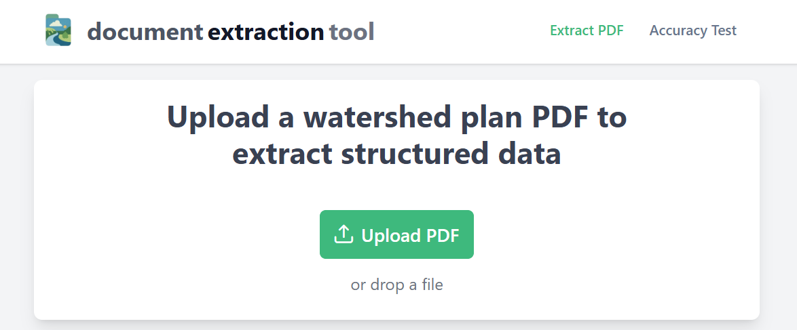

# Document Extraction Tool - Frontend

> **Note:** This repository contains the **frontend** codebase for the Document Extraction Tool. The backend is available at [doc-extractor-tool-backend](https://github.com/aimoradajr/doc-extractor-tool-backend).



## Documentation

- [Deployment Guide](DEPLOYMENT.md) - Setup and deployment instructions
- [Extraction Logic](EXTRACTION_LOGIC.md) - AI extraction algorithms and processing workflows
- [Testing Documentation](TESTING.md) - Testing strategies and validation methods

## Project Overview

AI-powered tool for extracting structured data from agricultural and environmental PDF reports with comprehensive accuracy testing and validation capabilities.

Special focus on parsing and organizing information from watershed plan documents, enabling users to extract actionable insights from complex environmental reports.

## Technical Architecture

- **Frontend (this repo):**

  - **Framework:** Angular 19 (standalone components, signals for state management)
  - **UI Library:** PrimeNG (rich UI components)
  - **Styling:** Tailwind CSS (utility-first, responsive design)
  - **Charts:** ng2-charts (Angular-integrated Chart.js wrapper for visual analytics)
  - **Structure:** Modular features (upload, test, dashboard), shared components, core services, and interfaces for type safety
  - **Build Tools:** Angular CLI, SCSS, PostCSS, Tailwind plugins

- **Backend:** [doc-extractor-tool-backend](https://github.com/aimoradajr/doc-extractor-tool-backend)
  - **Framework:** Express.js (Node.js REST API)
  - **PDF Parsing:** pdf-parse
  - **AI Integration:** OpenAI (for intelligent extraction)

## Key Features

- **PDF Upload & Intelligent Extraction**: Drag-and-drop interface for uploading watershed plan PDFs, with real-time AI-powered data extraction.
- **Context Parsing**: Automatically identifies and organizes key report elements including goals, BMPs (Best Management Practices), implementation activities, monitoring metrics, outreach efforts, and geographic information.
- **Data Categorization & Chart Dashboard**: Visualizes extracted data in interactive charts and dashboards for easy analysis.
- **Export Results**: Download structured results in CSV or JSON formats for further use or reporting.

## Installation

To set up the frontend locally:

1. **Clone the repository**
   ```sh
   git clone https://github.com/aimoradajr/doc-extractor-tool-frontend.git
   cd doc-extractor-tool-frontend
   ```
2. **Install dependencies**
   ```sh
   npm install
   ```
3. **Start the development server**
   ```sh
   npm start
   ```
   The app will be available at [http://localhost:4200](http://localhost:4200).

**Note:**

- Make sure you have [Node.js](https://nodejs.org/) and [npm](https://www.npmjs.com/) installed.
- For full functionality, you may also want to set up the backend ([doc-extractor-tool-backend](https://github.com/aimoradajr/doc-extractor-tool-backend)).

## Environment Configuration

Angular uses environment files to manage API endpoints and other settings for different build modes:

- **Development (`src/environments/environment.ts`)**
  ```typescript
  // Default environment (development)
  export const environment = {
    production: false,
    apiUrl: "http://localhost:5000/api",
  };
  ```
- **Production (`src/environments/environment.prod.ts`)**
  ```typescript
  // Production environment
  export const environment = {
    production: true,
    apiUrl: "https://doc-extractor-tool-backend.onrender.com/api",
  };
  ```
