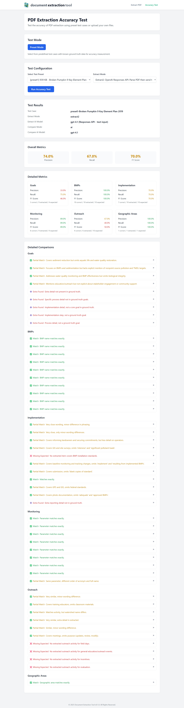

# Testing

Extraction accuracy is primarily tested using backend tools and scripts. For full details, see the backend documentation: [doc-extractor-tool-backend Testing Guide](https://github.com/aimoradajr/doc-extractor-tool-backend/blob/main/TESTING.md)

## Quick Accuracy Testing via Frontend

You can easily run accuracy tests from the frontend:

- Go to the `/test` route (or click 'Accuracy Test' in the app menu header).
- Select a test preset and extraction mode.
- Click 'Run Accuracy Test'.
- The results will be displayed in the UI.

This provides a simple way to validate extraction logic and compare modes directly from the web app.

